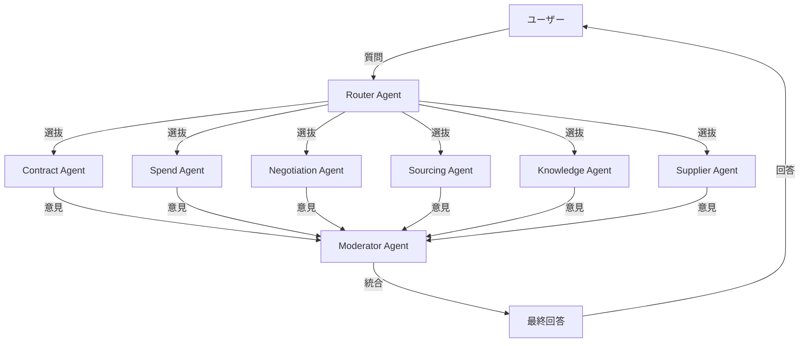

# AskAI - エージェント型調達支援システム

Microsoft Agent Framework を活用した、Azure OpenAI ベースの調達領域専門家エージェントシステムです。

## 概要

調達関連の社内問い合わせに対し、複数の専門家エージェントが協力して回答を生成するシステムです。
Router による動的な専門家選抜、並列実行、Moderator による統合機能を備えています。

## ワークフロー実装

本リポジトリには4つのワークフロー実装が含まれています:

### 1. TaskBasedWorkflow 🆕 **NEW**

**最新の実装**で、Planner による動的タスク計画とWorker による順次実行を実現しています。

```
User → Planner (計画作成) → Workers (タスク実行) → Final Report
```

**特徴:**
- ✅ Planner が目標を分析してタスク計画を自動生成
- ✅ 各タスクに担当専門家を自動割り当て
- ✅ タスクボードで進捗を管理（Queued/Doing/Done/Blocked）
- ✅ タスクの順次実行と結果の統合
- ✅ 複雑な目標を段階的に達成

**詳細:** [TaskBasedWorkflow README](src/TaskBasedWorkflow/README.md)

### 2. SelectiveGroupChatWorkflow ⭐ **推奨**

**最新の実装**で、動的エージェント選抜とモデレーターによる統合を実現しています。

```
User → Router (選抜) → Specialists (並列) → Moderator (統合) → Final Reply
```

**特徴:**
- ✅ Router が必要な専門家だけを動的に選抜
- ✅ 選抜された専門家が並列で意見を提供
- ✅ Moderator が専門家の意見を統合して構造化された回答を生成
- ✅ コストと応答時間の最適化
- ✅ フォールバック機能による高い可用性

**詳細:** [SelectiveGroupChatWorkflow README](src/SelectiveGroupChatWorkflow/README.md)

### 3. HandoffWorkflow

ルーターと専門家グループ間の双方向ハンドオフを実装した従来型のワークフローです。

```
User → Router ⇔ Specialists (ハンドオフ) → Router (統合) → Final Reply
```

**特徴:**
- Router と各専門家間で双方向のハンドオフが可能
- 専門家が他の専門家の意見を求める場合に Router 経由で連携
- すべての専門家が利用可能

**詳細:** [HandoffWorkflow](src/HandoffWorkflow)

### 4. GroupChatWorkflow

RoundRobin 方式で全専門家が順番に発言する従来型のグループチャット実装です。

```
User → [All Specialists in Round-Robin] → Final Reply
```

**特徴:**
- 全専門家がラウンドロビン方式で順番に発言
- 最大5ラウンドまで議論を継続
- すべての専門家の意見を収集

**詳細:** [GroupChatWorkflow](src/GroupChatWorkflow)

## 専門家エージェント

システムには以下の6つの専門家エージェントが含まれています:

| エージェント | 役割 |
|-----------|------|
| **Contract** | 契約関連の専門家 |
| **Spend** | 支出分析の専門家 |
| **Negotiation** | 交渉戦略の専門家 |
| **Sourcing** | 調達戦略の専門家 |
| **Knowledge** | 知識管理の専門家 |
| **Supplier** | サプライヤー管理の専門家 |

## アーキテクチャ



## セットアップ

### 前提条件

- .NET 8 SDK 以降
- Azure OpenAI サービスへのアクセス
- Azure CLI（認証用）
- （オプション）Aspire Dashboard または Application Insights（テレメトリ用）

### 環境設定

1. Azure CLI でログイン:
```bash
az login
```

2. 環境変数を設定:
```bash
export AZURE_OPENAI_ENDPOINT="https://your-endpoint.openai.azure.com/"
export AZURE_OPENAI_DEPLOYMENT_NAME="gpt-4o"
```

3. （オプション）テレメトリ設定:
```bash
# Aspire Dashboard を使用する場合（推奨）
export OTEL_EXPORTER_OTLP_ENDPOINT="http://localhost:4317"

# Application Insights を使用する場合
export APPLICATIONINSIGHTS_CONNECTION_STRING="InstrumentationKey=...;IngestionEndpoint=..."
```

または、各プロジェクトの `appsettings.Development.json` に設定:
```json
{
  "environmentVariables": {
    "AZURE_OPENAI_ENDPOINT": "https://your-endpoint.openai.azure.com/",
    "AZURE_OPENAI_DEPLOYMENT_NAME": "gpt-4o"
  },
  "OTEL_EXPORTER_OTLP_ENDPOINT": "http://localhost:4317"
}
```

### ビルド

```bash
dotnet build
```

## 実行方法

### TaskBasedWorkflow を実行 🆕

```bash
cd src/TaskBasedWorkflow
dotnet run
```

### SelectiveGroupChatWorkflow を実行（推奨）

```bash
cd src/SelectiveGroupChatWorkflow
dotnet run
```

### HandoffWorkflow を実行

```bash
cd src/HandoffWorkflow
dotnet run
```

### GroupChatWorkflow を実行

```bash
cd src/GroupChatWorkflow
dotnet run
```

## 使用例

```
質問> 新規サプライヤーとの契約で注意すべき点は？

━━━━━━━━━━━━━━━━━━━━━━━━━━━━━━━━━━━━━━━━
フェーズ 1: ルーターが必要な専門家を選抜
━━━━━━━━━━━━━━━━━━━━━━━━━━━━━━━━━━━━━━━━

✓ 選抜された専門家: Contract, Negotiation, Supplier
✓ 選抜理由: 契約、交渉、サプライヤー管理の観点が必要

━━━━━━━━━━━━━━━━━━━━━━━━━━━━━━━━━━━━━━━━
フェーズ 2: 選抜された専門家が並列で意見を提供
━━━━━━━━━━━━━━━━━━━━━━━━━━━━━━━━━━━━━━━━

[Contract Agent の意見]
契約条項の明確化、期間、支払条件、違約金の設定が重要です。

[Negotiation Agent の意見]
事前の市場調査、条件の優先順位付けを行いましょう。

[Supplier Agent の意見]
サプライヤーの信頼性評価、実績確認が必須です。

━━━━━━━━━━━━━━━━━━━━━━━━━━━━━━━━━━━━━━━━
フェーズ 3: モデレーターが専門家の意見を統合
━━━━━━━━━━━━━━━━━━━━━━━━━━━━━━━━━━━━━━━━

## 結論
新規サプライヤーとの契約では、契約条項の明確化、交渉戦略の準備、
サプライヤーの信頼性評価を総合的に実施することが重要です。

## 根拠
Contract 専門家からは契約条項の明確化が最優先との指摘があり、
Negotiation 専門家からは事前準備の重要性、Supplier 専門家からは
信頼性評価の必要性が示されました。

## 各専門家の所見
- **Contract**: 契約条項の明確化が最優先
- **Negotiation**: Win-Win の関係構築を目指す
- **Supplier**: サプライヤーの信頼性評価が必須

## 次のアクション
1. サプライヤーの実績・信頼性調査
2. 契約条項のドラフト作成
3. 交渉ポイントの洗い出しと優先順位付け
```

## ワークフロー比較

| 特徴 | TaskBased | SelectiveGroupChat | Handoff | GroupChat |
|-----|-----------|-------------------|---------|-----------|
| 専門家選抜 | ✅ Plannerが割当 | ✅ 動的選抜 | ❌ 全員利用可能 | ❌ 全員参加 |
| タスク管理 | ✅ タスクボード | ❌ なし | ❌ なし | ❌ なし |
| 並列実行 | ❌ 順次実行 | ✅ あり | ❌ なし | ❌ なし |
| 統合機能 | ✅ 最終レポート | ✅ Moderator | Router | なし |
| 計画性 | ⭐⭐⭐ | ⭐ | ⭐⭐ | ⭐ |
| コスト効率 | ⭐⭐ | ⭐⭐⭐ | ⭐⭐ | ⭐ |
| 応答時間 | ⭐⭐ | ⭐⭐⭐ | ⭐⭐ | ⭐ |
| 対話能力 | ⭐⭐ | ⭐⭐ | ⭐⭐⭐ | ⭐⭐ |
| 適用場面 | 複雑な目標の段階的達成 | 効率的な専門家活用 | 専門家間の対話が必要 | 全員の意見が必要 |

## 技術スタック

- **.NET 8**: アプリケーションフレームワーク
- **Microsoft.Agents.AI.Workflows**: エージェントワークフローの構築
- **Microsoft.Extensions.AI**: AI モデル統合
- **Azure.AI.OpenAI**: Azure OpenAI サービス連携
- **Azure.Identity**: Azure 認証
- **OpenTelemetry**: テレメトリとログの統合
- **Microsoft.Extensions.Logging**: 構造化ロギング

## ロギングとテレメトリ

すべてのワークフローは OpenTelemetry を使用した構造化ロギングをサポートしています。

- **Aspire Dashboard**: 軽量なローカルダッシュボード（推奨）
- **Application Insights**: Azure のフルマネージドテレメトリサービス
- **コンソール**: 開発時のリアルタイム出力

詳細は [ロギング設定ガイド](docs/logging-setup.md) を参照してください。

### Aspire Dashboard のクイックスタート

```bash
# .NET Aspire をインストール
dotnet workload install aspire

# Aspire Dashboard を起動（Docker）
docker run --rm -it -p 18888:18888 -p 4317:18889 \
    mcr.microsoft.com/dotnet/aspire-dashboard:latest

# ブラウザで http://localhost:18888 を開く
```

## ドキュメント

- [システム要件定義および基本設計](docs/system-requirements.md)
- [ロギング設定ガイド](docs/logging-setup.md) 🆕
- [SelectiveGroupChatWorkflow 詳細](src/SelectiveGroupChatWorkflow/README.md)

## ライセンス

このプロジェクトはサンプル実装です。

## 貢献

Issues や Pull Requests は歓迎します。

## 今後の拡張予定

- [ ] HITL (Human-In-The-Loop) 承認機能の統合
- [ ] 品質スコアに基づく再試行機能
- [ ] 専門家の動的な追加・削除機能
- [ ] 実行ログとテレメトリの強化
- [ ] チェックポイント機能による途中復旧
