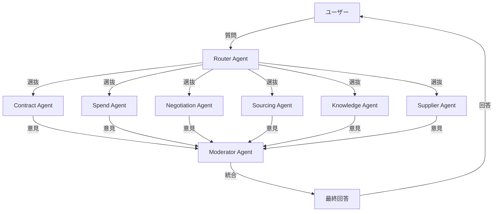

# AskAI - Microsoft Agent Framework サンプル集

Microsoft Agent Framework を使用した、様々なワークフローパターンのサンプル実装です。

## 概要

調達領域をユースケースとした、以下の 5 つのワークフローパターンを提供しています:

1. **GroupChatWorkflow**: ラウンドロビン方式の全員参加型グループチャット
2. **HandoffWorkflow**: ハンドオフベースの動的な専門家選抜
3. **SelectiveGroupChatWorkflow**: 事前選抜と並列実行による効率的な専門家活用
4. **TaskBasedWorkflow**: タスク管理に基づく段階的な目標達成
5. **DynamicGroupChatWorkflow**: 動的選抜 + HITL (Human-in-the-Loop) 🆕

各ワークフローは異なる設計思想とユースケースに対応しています。

## プロジェクト一覧

### 1. TaskBasedWorkflow 🆕 **NEW**

**最新の実装**で、Planner による動的タスク計画と Worker による順次実行を実現しています。

```
User → Planner (計画作成) → Workers (タスク実行) → Final Report
```

**特徴:**

- ✅ Planner が目標を分析してタスク計画を自動生成
- ✅ 各タスクに担当専門家を自動割り当て
- ✅ タスクボードで進捗を管理（Queued/Doing/Done/Blocked）
- ✅ タスクの順次実行と結果の統合
- ✅ 複雑な目標を段階的に達成

**詳細:** [TaskBasedWorkflow README](src/TaskBasedWorkflow/README.md)

### 2. SelectiveGroupChatWorkflow ⭐ **推奨**

**最新の実装**で、動的エージェント選抜とモデレーターによる統合を実現しています。

```
User → Router (選抜) → Specialists (並列) → Moderator (統合) → Final Reply
```

**特徴:**

- ✅ Router が必要な専門家だけを動的に選抜
- ✅ 選抜された専門家が並列で意見を提供
- ✅ Moderator が専門家の意見を統合して構造化された回答を生成
- ✅ コストと応答時間の最適化
- ✅ フォールバック機能による高い可用性

**詳細:** [SelectiveGroupChatWorkflow README](src/SelectiveGroupChatWorkflow/README.md)

### 3. HandoffWorkflow

ルーターと専門家グループ間の双方向ハンドオフを実装した従来型のワークフローです。

```
User → Router ⇔ Specialists (ハンドオフ) → Router (統合) → Final Reply
```

**特徴:**

- Router と各専門家間で双方向のハンドオフが可能
- 専門家が他の専門家の意見を求める場合に Router 経由で連携
- すべての専門家が利用可能

**詳細:** [HandoffWorkflow](src/HandoffWorkflow)

### 4. GroupChatWorkflow

RoundRobin 方式で全専門家が順番に発言する従来型のグループチャット実装です。

```
User → [All Specialists in Round-Robin] → Final Reply
```

**特徴:**

- 全専門家がラウンドロビン方式で順番に発言
- 最大 5 ラウンドまで議論を継続
- すべての専門家の意見を収集

**詳細:** [GroupChatWorkflow](src/GroupChatWorkflow)

### 5. DynamicGroupChatWorkflow 🆕

動的な専門家選抜と HITL (Human-in-the-Loop) 承認を組み合わせた最新のワークフローです。

```
User → Router (動的選抜) ↔️ Specialist Group (HITL) ↔️ Router (統合) → Final Reply
```

**特徴:**

- ✅ ユーザーの質問に対し、動的に専門家を選抜
- ✅ Specialist Group による双方向ハンドオフと対話
- ✅ HITL による人的承認・補足情報の取得
- ✅ Moderator による最終的な意見の統合
- ✅ 複雑なケースや特殊な要求に対応可能

**詳細:** [DynamicGroupChatWorkflow README](src/DynamicGroupChatWorkflow/README.md)

## 専門家エージェント

システムには以下の 6 つの専門家エージェントが含まれれていますが、DynamicGroupChatWorkflow では状況に応じて柔軟に追加・削除が可能です。

| エージェント    | 役割                     |
| --------------- | ------------------------ |
| **Contract**    | 契約関連の専門家         |
| **Spend**       | 支出分析の専門家         |
| **Negotiation** | 交渉戦略の専門家         |
| **Sourcing**    | 調達戦略の専門家         |
| **Knowledge**   | 知識管理の専門家         |
| **Supplier**    | サプライヤー管理の専門家 |

## アーキテクチャ



## セットアップ

### 前提条件

- .NET 8 SDK 以降
- Azure OpenAI サービスへのアクセス
- Azure CLI（認証用）
- （オプション）Aspire Dashboard または Application Insights（テレメトリ用）

### 環境設定

1. Azure CLI でログイン:

```bash
az login
```

2. 環境変数を設定:

```bash
export AZURE_OPENAI_ENDPOINT="https://your-endpoint.openai.azure.com/"
export AZURE_OPENAI_DEPLOYMENT_NAME="gpt-4o"
```

3. （オプション）テレメトリ設定:

```bash
# Aspire Dashboard を使用する場合（推奨）
export OTEL_EXPORTER_OTLP_ENDPOINT="http://localhost:4317"

# Application Insights を使用する場合
export APPLICATIONINSIGHTS_CONNECTION_STRING="InstrumentationKey=...;IngestionEndpoint=..."
```

または、各プロジェクトの `appsettings.Development.json` に設定:

```json
{
  "environmentVariables": {
    "AZURE_OPENAI_ENDPOINT": "https://your-endpoint.openai.azure.com/",
    "AZURE_OPENAI_DEPLOYMENT_NAME": "gpt-4o"
  },
  "OTEL_EXPORTER_OTLP_ENDPOINT": "http://localhost:4317"
}
```

### ビルド

```bash
dotnet build
```

## 実行方法

### DynamicGroupChatWorkflow を実行 🆕

```bash
cd src/DynamicGroupChatWorkflow
dotnet run
```

### TaskBasedWorkflow を実行

```bash
cd src/TaskBasedWorkflow
dotnet run
```

### SelectiveGroupChatWorkflow を実行（推奨）

```bash
cd src/SelectiveGroupChatWorkflow
dotnet run
```

### HandoffWorkflow を実行

```bash
cd src/HandoffWorkflow
dotnet run
```

### GroupChatWorkflow を実行

```bash
cd src/GroupChatWorkflow
dotnet run
```

## 使用例

### SelectiveGroupChatWorkflow の例

```
質問> 新規サプライヤーとの契約で注意すべき点は？

━━━━━━━━━━━━━━━━━━━━━━━━━━━━━━━━━━━━━━━━
フェーズ 1: ルーターが必要な専門家を選抜
━━━━━━━━━━━━━━━━━━━━━━━━━━━━━━━━━━━━━━━━

✓ 選抜された専門家: Contract, Negotiation, Supplier
✓ 選抜理由: 契約、交渉、サプライヤー管理の観点が必要

━━━━━━━━━━━━━━━━━━━━━━━━━━━━━━━━━━━━━━━━
フェーズ 2: 選抜された専門家が並列で意見を提供
━━━━━━━━━━━━━━━━━━━━━━━━━━━━━━━━━━━━━━━━

[Contract Agent の意見]
契約条項の明確化、期間、支払条件、違約金の設定が重要です。

[Negotiation Agent の意見]
事前の市場調査、条件の優先順位付けを行いましょう。

[Supplier Agent の意見]
サプライヤーの信頼性評価、実績確認が必須です。

━━━━━━━━━━━━━━━━━━━━━━━━━━━━━━━━━━━━━━━━
フェーズ 3: モデレーターが専門家の意見を統合
━━━━━━━━━━━━━━━━━━━━━━━━━━━━━━━━━━━━━━━━

## 結論
新規サプライヤーとの契約では、契約条項の明確化、交渉戦略の準備、
サプライヤーの信頼性評価を総合的に実施することが重要です。

## 根拠
Contract 専門家からは契約条項の明確化が最優先との指摘があり、
Negotiation 専門家からは事前準備の重要性、Supplier 専門家からは
信頼性評価の必要性が示されました。

## 各専門家の所見
- **Contract**: 契約条項の明確化が最優先
- **Negotiation**: Win-Win の関係構築を目指す
- **Supplier**: サプライヤーの信頼性評価が必須

## 次のアクション
1. サプライヤーの実績・信頼性調査
2. 契約条項のドラフト作成
3. 交渉ポイントの洗い出しと優先順位付け
```

### DynamicGroupChatWorkflow の例（HITL） 🆕

```
質問> 新しいサプライヤーとの契約交渉で注意すべき点は？予算は500万円です。

━━━━━━━━━━━━━━━━━━━━━━━━━━━━━━━━━━━━━━━━
ワークフロー実行開始
━━━━━━━━━━━━━━━━━━━━━━━━━━━━━━━━━━━━━━━━

━━━ Router Agent ━━━
Contract Agent にハンドオフします。

━━━ Contract Agent ━━━
契約条項の明確化が重要です。特に支払条件、納期、違約金について...

━━━ Router Agent ━━━
希望する契約期間を教えてください。

━━━━━━━━━━━━━━━━━━━━━━━━━━━━━━━━━━━━━━━━
👤 ユーザー入力が必要です
━━━━━━━━━━━━━━━━━━━━━━━━━━━━━━━━━━━━━━━━

希望する契約期間を教えてください。

回答> 3年希望です

✓ 回答を送信しました

━━━ Router Agent ━━━
Sourcing Agent にハンドオフします。

━━━ Sourcing Agent ━━━
予算500万円、期間3年であれば、既存サプライヤーベースの拡張が現実的です...

━━━ Router Agent ━━━
Moderator Agent にハンドオフします。

━━━ Moderator Agent ━━━

## 結論
予算500万円、契約期間3年の制約下では、契約条項の明確化と既存サプライヤーベースの拡張が最適解です。

## 根拠
- Contract Agent: 契約条項の明確化が必須
- Sourcing Agent: 予算・期限制約下では既存ベース拡張が現実的

## 各専門家の所見
- Contract: 契約条項の明確化が最優先
- Sourcing: 既存サプライヤーベースの拡張を推奨

## ユーザーからの追加情報
- 予算: 500万円
- 希望契約期間: 3年

## 次のアクション
1. 既存サプライヤーの評価
2. 契約条項ドラフトの作成
3. 交渉ポイントの洗い出し
```

## ワークフロー比較

| 特徴         | DynamicGroupChat 🆕 | TaskBased              | SelectiveGroupChat | Handoff              | GroupChat        |
| ------------ | ------------------- | ---------------------- | ------------------ | -------------------- | ---------------- |
| 専門家選抜   | ✅ 動的ハンドオフ   | ✅ Planner が割当      | ✅ 事前選抜 (JSON) | ✅ 動的ハンドオフ    | ❌ 全員参加      |
| タスク管理   | ❌ なし             | ✅ タスクボード        | ❌ なし            | ❌ なし              | ❌ なし          |
| 実行方式     | 順次ハンドオフ      | 順次実行               | 並列実行           | 順次ハンドオフ       | ラウンドロビン   |
| HITL         | ✅ Human Agent      | ❌ なし                | ❌ なし            | ❌ なし              | ❌ なし          |
| 専門家間対話 | ✅ あり             | ❌ なし                | ❌ なし            | ✅ あり              | ✅ あり          |
| 統合機能     | ✅ Moderator        | ✅ 最終レポート        | ✅ Moderator       | Router               | なし             |
| 可視化       | ✅ 可能             | ⚠️ 部分的              | ❌ 困難            | ✅ 可能              | ✅ 可能          |
| テレメトリ   | ✅ OpenTelemetry    | ❌ なし                | ❌ なし            | ✅ OpenTelemetry     | ❌ なし          |
| 計画性       | ⭐⭐                | ⭐⭐⭐                 | ⭐                 | ⭐⭐                 | ⭐               |
| 柔軟性       | ⭐⭐⭐              | ⭐⭐                   | ⭐                 | ⭐⭐⭐               | ⭐               |
| コスト効率   | ⭐⭐                | ⭐⭐                   | ⭐⭐⭐             | ⭐⭐                 | ⭐               |
| 応答時間     | ⭐⭐                | ⭐⭐                   | ⭐⭐⭐             | ⭐⭐                 | ⭐               |
| 対話能力     | ⭐⭐⭐              | ⭐⭐                   | ⭐⭐               | ⭐⭐⭐               | ⭐⭐             |
| 適用場面     | ユーザー入力が必要  | 複雑な目標の段階的達成 | 効率的な専門家活用 | 専門家間の対話が必要 | 全員の意見が必要 |

### ワークフロー選択ガイド

**質問: ユーザーの追加情報が必要か？**

- **Yes** → `DynamicGroupChatWorkflow` 🆕

**質問: 専門家間の対話が必要か？**

- **Yes** → `HandoffWorkflow` または `GroupChatWorkflow`
- **No** → 次へ

**質問: 高速な応答が必要か？**

- **Yes** → `SelectiveGroupChatWorkflow` (並列実行)
- **No** → 次へ

**質問: タスク管理が必要か？**

- **Yes** → `TaskBasedWorkflow`
- **No** → `HandoffWorkflow`

## 技術スタック

- **.NET 8**: アプリケーションフレームワーク
- **Microsoft.Agents.AI.Workflows**: エージェントワークフローの構築
- **Microsoft.Extensions.AI**: AI モデル統合
- **Azure.AI.OpenAI**: Azure OpenAI サービス連携
- **Azure.Identity**: Azure 認証
- **OpenTelemetry**: テレメトリとログの統合
- **Microsoft.Extensions.Logging**: 構造化ロギング

## ロギングとテレメトリ

すべてのワークフローは OpenTelemetry を使用した構造化ロギングをサポートしています。

- **Aspire Dashboard**: 軽量なローカルダッシュボード（推奨）
- **Application Insights**: Azure のフルマネージドテレメトリサービス
- **コンソール**: 開発時のリアルタイム出力

詳細は [ロギング設定ガイド](docs/logging-setup.md) を参照してください。

### Aspire Dashboard のクイックスタート

```bash
# Docker で Aspire Dashboard を起動
docker run --rm -it -p 18888:18888 -p 4317:18889 -d --name aspire-dashboard \
    mcr.microsoft.com/dotnet/aspire-dashboard:latest

# アプリケーションを実行
cd src/SelectiveGroupChatWorkflow
dotnet run

# ブラウザで http://localhost:18888 を開く
```

## GitHub Copilot カスタムエージェント 🆕

このリポジトリには、開発を支援する 5 つのカスタムエージェントが定義されています：

| エージェント                   | 専門分野                                        |
| ------------------------------ | ----------------------------------------------- |
| **agent-framework-expert**     | Microsoft Agent Framework の設計と実装          |
| **test-expert**                | .NET テストの戦略と実装                         |
| **documentation-expert**       | 日本語・英語の技術ドキュメント作成              |
| **dotnet-architecture-expert** | .NET 8/C#のアーキテクチャとベストプラクティス   |
| **azure-openai-expert**        | Azure OpenAI Service と Microsoft.Extensions.AI |

**使用方法:**

```
@agent-framework-expert 新しいワークフローパターンを実装したい
@test-expert このワークフローの単体テストを作成したい
@documentation-expert READMEを更新したい
```

詳細は [GitHub Copilot カスタムエージェント ガイド](.github/agents/README.md) を参照してください。

## ドキュメント

- [システム要件定義および基本設計](docs/system-requirements.md)
- [ロギング設定ガイド](docs/logging-setup.md)
- [コメント形式標準](docs/comment-format-standards.md)
- [GitHub Copilot カスタムエージェント詳細ガイド](docs/custom-agents.md) 🆕
- [GitHub Copilot カスタムエージェント クイックガイド](.github/agents/README.md) 🆕
- [DynamicGroupChatWorkflow 詳細](src/DynamicGroupChatWorkflow/README.md)

### GitHub Copilot 向け

- [🤖 GitHub Copilot Instructions](.github/copilot-instructions.md) - GitHub Copilot が参照するプロジェクトコンテキスト

### アーキテクチャ

- [🏗️ クリーンアーキテクチャ](docs/architecture/clean-architecture.md) - アーキテクチャの詳細説明
- [📋 システム要件定義および基本設計](docs/architecture/system-requirements.md)

### 開発ガイド

- [📝 ロギング設定ガイド](docs/development/logging-setup.md)
- [✍️ コーディング標準](docs/development/coding-standards.md)

### ワークフロー詳細

- [SelectiveGroupChatWorkflow 実装概要](docs/workflows/implementation-summary.md)
- [TaskBasedWorkflow 実装概要](docs/workflows/task-workflow.md)
- [GraphExecutor 調査結果](docs/workflows/graph-executor-investigation.md)
- [GraphExecutor サマリー](docs/workflows/graph-executor-summary.md)
- [AdvancedConditionalWorkflow 実装詳細](docs/workflows/advanced-conditional-workflow.md)

### 各ワークフローの README

- [DynamicGroupChatWorkflow 詳細](src/DynamicGroupChatWorkflow/README.md) 🆕
- [SelectiveGroupChatWorkflow 詳細](src/SelectiveGroupChatWorkflow/README.md)
- [TaskBasedWorkflow 詳細](src/TaskBasedWorkflow/README.md)

## ライセンス

このプロジェクトはサンプル実装です。

## 貢献

Issues や Pull Requests は歓迎します。

## 今後の拡張予定

- [x] HITL (Human-In-The-Loop) 承認機能の統合 ✅ DynamicGroupChatWorkflow で実装
- [ ] 品質スコアに基づく再試行機能
- [ ] 専門家の動的な追加・削除機能
- [ ] 実行ログとテレメトリの強化
- [ ] チェックポイント機能による途中復旧
- [ ] Mermaid ワークフロー可視化の自動生成
