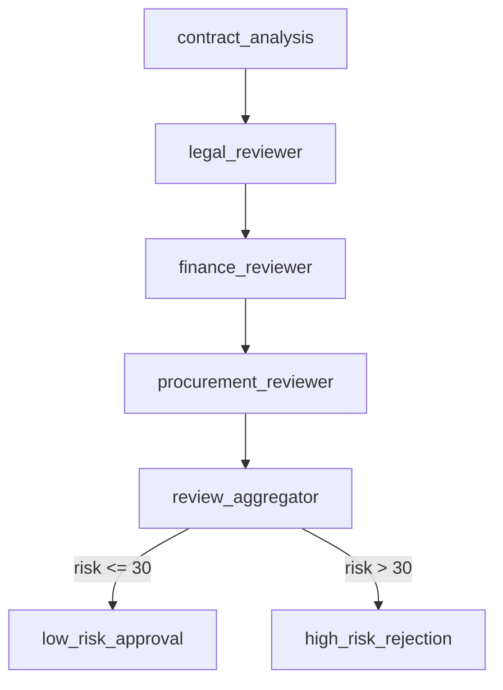

# Advanced Conditional Workflow

Microsoft Agent Framework の高度な機能 (Condition, Loop, HITL, Visualize, Multi-Selection) を統合した、契約レビュー → 自動交渉 → 承認プロセスのデモワークフローです。

## 📋 概要

このワークフローは、調達ドメインにおける高額契約の自動レビュー・リスク評価・交渉・承認プロセスを実装しています。

### デモシナリオ: 「高額契約の自動レビュー・交渉・承認プロセス」

新規サプライヤーとの $500,000 の契約について:

1. **契約分析** - 契約情報を分析
2. **並列レビュー** - 法務・財務・調達の 3 専門家が順次レビュー (将来的に並列実行に拡張可能)
3. **リスク評価** - 各専門家の意見を統合し、総合リスクスコアを計算
4. **条件分岐** - リスクレベルに応じて自動判定
   - 低リスク (0-30 点): 自動承認
   - 中リスク (31-70 点): 交渉プロセスへ (将来実装)
   - 高リスク (71-100 点): 自動却下
5. **最終決定** - 結果を表示

## 🎯 実装されている Agent Framework 機能

### 1. Conditional Edges (条件付きエッジ)

リスクスコアに基づいて、異なる処理パスに分岐します。

```csharp
builder
    .AddEdge(aggregator, lowRiskApproval,
        condition: (RiskAssessment? risk) => risk != null && risk.OverallRiskScore <= 30)
    .AddEdge(aggregator, highRiskRejection,
        condition: (RiskAssessment? risk) => risk != null && risk.OverallRiskScore > 30);
```

### 2. Multi-Selection Routing (並列実行)

将来実装予定: 複数の専門家を並列実行し、効率的にレビューを実施します。

```csharp
// 将来実装予定
builder.AddFanOutEdge(
    analysisExecutor,
    targets: [legalReviewer, financeReviewer, procurementReviewer],
    partitioner: GetPartitioner()
);
```

### 3. Visualization (ワークフロー可視化)

Mermaid 形式でワークフロー構造を自動出力します。

```csharp
var mermaidDiagram = workflow.ToMermaidString();
Console.WriteLine(mermaidDiagram);
```

### 4. Loop (交渉ループ) - 将来実装予定

中リスク契約に対して、交渉エージェントと評価エージェント間でループし、目標リスクスコア達成まで最大 3 回反復します。

### 5. HITL (Human-in-the-Loop) - 将来実装予定

交渉不成立時や最終承認前に、人間の承認ゲートを設けます。

```csharp
// 将来実装予定
RequestPort approvalRequest = RequestPort.Create<ApprovalRequest, ApprovalResponse>("ApprovalRequired");
```

### 6. Checkpoint & Resume - 将来実装予定

長時間処理や承認待ち状態をチェックポイントとして保存し、再開可能にします。

```csharp
// 将来実装予定
await using Checkpointed<StreamingRun> checkpointedRun =
    await InProcessExecution.StreamAsync(workflow, input, CheckpointManager.Default);
```

## 🏗️ アーキテクチャ

### Executor 構成

#### 1. ContractAnalysisExecutor

契約情報を分析し、レビューが必要な専門分野を特定します。

#### 2. SpecialistReviewExecutor

各専門家 (Legal, Finance, Procurement) が契約をレビューし、リスクスコアと推奨事項を提供します。

- **Legal (法務)**: 法的リスク、コンプライアンス、規制要件
- **Finance (財務)**: 財務影響、予算管理、ROI 分析
- **Procurement (調達実務)**: 調達プロセス、購買手続き、契約管理

#### 3. ParallelReviewAggregator

複数の専門家レビューを統合し、総合的なリスク評価を行います。

- 平均リスクスコアを計算
- リスクレベルを判定 (Low/Medium/High)
- 全専門家の意見を集約したサマリーを生成

#### 4. LowRiskApprovalExecutor / HighRiskRejectionExecutor

リスクレベルに応じて、自動承認または自動却下を行います。

#### 5. NegotiationExecutor (将来実装予定)

リスク軽減のための交渉提案を生成します。

#### 6. EvaluationExecutor (将来実装予定)

交渉提案の効果を評価し、継続判定を行います。

### データモデル

- **ContractInfo**: 契約情報
- **ReviewResult**: 専門家レビュー結果
- **RiskAssessment**: 総合リスク評価
- **NegotiationProposal**: 交渉提案 (将来実装)
- **EvaluationResult**: 評価結果 (将来実装)
- **ApprovalRequest/Response**: 承認要求/応答 (将来実装)
- **FinalDecision**: 最終決定

## 🚀 実行方法

### 前提条件

- .NET 8.0 SDK
- Azure OpenAI API アクセス
- Azure CLI (`az login` 実行済み)
- (オプション) Aspire Dashboard (OpenTelemetry 可視化用)

### 環境設定

`appsettings.Development.json` を編集して、Azure OpenAI エンドポイントを設定します:

```json
{
  "environmentVariables": {
    "AZURE_OPENAI_ENDPOINT": "https://your-endpoint.openai.azure.com/",
    "AZURE_OPENAI_DEPLOYMENT_NAME": "gpt-4o"
  },
  "OTEL_EXPORTER_OTLP_ENDPOINT": "http://localhost:4317"
}
```

または、環境変数を設定します:

```powershell
$env:AZURE_OPENAI_ENDPOINT = "https://your-endpoint.openai.azure.com/"
$env:AZURE_OPENAI_DEPLOYMENT_NAME = "gpt-4o"
```

### 実行

```powershell
cd src/AdvancedConditionalWorkflow
dotnet run
```

### Aspire Dashboard の起動 (オプション)

テレメトリを可視化するには、プロジェクトルートで Docker Compose を起動します:

```powershell
docker compose up -d
```

ブラウザで http://localhost:18888 にアクセスしてダッシュボードを表示します。

## 📊 出力例

### ワークフロー構造 (Mermaid 図)

実行時にログ出力される Mermaid 図により、ワークフロー構造を可視化できます。



### デモ実行結果例

```
━━━━━━━━━━━━━━━━━━━━━━━━━━━━━━━━━━━━━━━━
デモ契約情報
━━━━━━━━━━━━━━━━━━━━━━━━━━━━━━━━━━━━━━━━
サプライヤー: Global Tech Solutions Inc.
契約金額: $500,000
契約期間: 24ヶ月
支払条件: Net 30

━━━━━━━━━━━━━━━━━━━━━━━━━━━━━━━━━━━━━━━━
ワークフロー実行開始
━━━━━━━━━━━━━━━━━━━━━━━━━━━━━━━━━━━━━━━━

🔍 Legal による契約レビューを開始
✓ Legal レビュー完了 (リスクスコア: 45)

🔍 Finance による契約レビューを開始
✓ Finance レビュー完了 (リスクスコア: 50)

🔍 Procurement による契約レビューを開始
✓ Procurement レビュー完了 (リスクスコア: 40)

📊 3件のレビュー結果を統合中...
✓ リスク評価完了: レベル=Medium, スコア=45

❌ 高リスク契約を自動却下

━━━━━━━━━━━━━━━━━━━━━━━━━━━━━━━━━━━━━━━━
🎉 ワークフロー完了
━━━━━━━━━━━━━━━━━━━━━━━━━━━━━━━━━━━━━━━━

【最終決定】
決定: Rejected
最終リスクスコア: 45/100
サマリー: リスクスコア 45/100 (高リスク) のため、却下されました。
次のアクション:
  - サプライヤーへの却下通知
  - 代替サプライヤーの検討
  - 要件の見直し
```

## 🔧 カスタマイズ

### リスク評価閾値の変更

`ParallelReviewAggregator.cs` と `Program.cs` の条件式を編集します:

```csharp
// 現在: 0-30: Low, 31-70: Medium, 71-100: High
var riskLevel = overallRiskScore switch
{
    <= 30 => "Low",
    <= 70 => "Medium",
    _ => "High"
};
```

### 専門家の追加

1. `Common/AgentFactory.cs` に新しい専門家メソッドを追加
2. `SpecialistReviewExecutor` で新しい専門家タイプを追加
3. ワークフローに新しいレビューアーを追加

## 📚 関連ドキュメント

- [Microsoft Agent Framework](https://learn.microsoft.com/ja-jp/dotnet/ai/quickstarts/quickstart-ai-chat-with-agents)
- [Azure OpenAI サービス](https://learn.microsoft.com/ja-jp/azure/ai-services/openai/)
- [OpenTelemetry .NET](https://opentelemetry.io/docs/languages/net/)

## 🛣️ ロードマップ

### Phase 2: 交渉ループの実装

- [ ] NegotiationExecutor と EvaluationExecutor の統合
- [ ] ループ条件の実装 (最大 3 回反復)
- [ ] 交渉履歴の記録

### Phase 3: HITL (Human-in-the-Loop) の実装

- [ ] RequestPort による承認要求
- [ ] コンソール Y/N 承認 UI
- [ ] 承認履歴の記録

### Phase 4: Checkpoint & Resume の実装

- [ ] CheckpointManager の統合
- [ ] 状態保存と復元機能
- [ ] 長時間処理の中断・再開サポート

### Phase 5: 真の並列実行 (Fan-Out/Fan-In)

- [ ] Multi-Selection Partitioner の実装
- [ ] 3 専門家の並列レビュー
- [ ] 並列実行結果の集約

## 📝 ライセンス

このプロジェクトは MIT ライセンスの下で公開されています。
