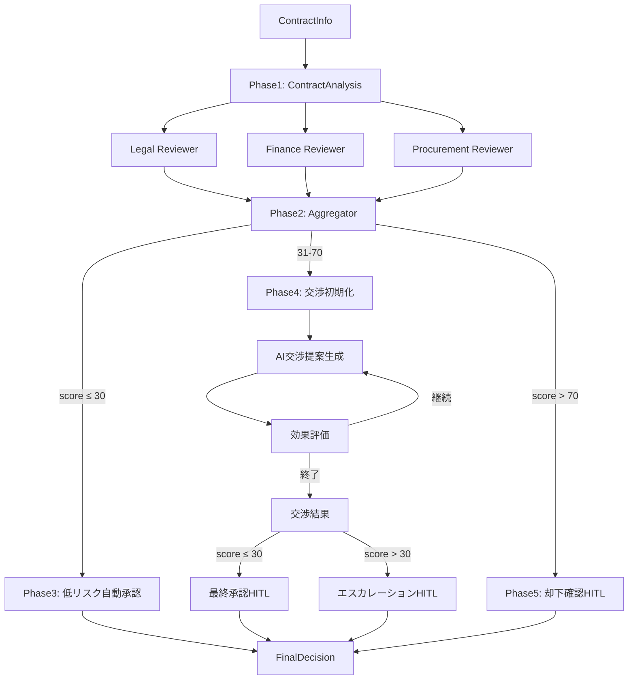

# Advanced Conditional Workflow

Microsoft Agent Framework の高度な機能 (Condition, Loop, HITL, Visualize, Multi-Selection) を統合した、契約レビュー → **AI 自動交渉** → **人間承認**プロセスの**完全実装**デモワークフローです。

## 📋 概要

このワークフローは、調達ドメインにおける高額契約の自動レビュー・リスク評価・**AI 交渉**・**人間承認**プロセスを実装しています。

### デモシナリオ: 「高額契約の自動レビュー・AI 交渉・承認プロセス」

新規サプライヤーとの契約について、以下のフローで処理します:

1. **契約分析** - 契約情報を分析し初期リスク評価
2. **Fan-Out/Fan-In** - 法務・財務・調達の 3 専門家が並列レビュー (構造上)
3. **リスク評価** - 各専門家の意見を統合し、総合リスクスコアを計算
4. **Switch (条件分岐)** - リスクレベルに応じて自動判定
   - **低リスク (≤30 点)**: 自動承認 ✅
   - **中リスク (31-70 点)**: **交渉ループへ** ✅ **実装済み**
   - **高リスク (>70 点)**: HITL 却下確認 ✅
5. **Loop (交渉反復)** - Azure OpenAI による自動交渉提案と効果評価 (最大 3 回) ✅ **実装済み**
6. **HITL (Human-in-the-Loop)** - コンソール経由の最終承認/エスカレーション/却下確認 ✅ **実装済み**
7. **最終決定** - 構造化された結果を表示

## 🎯 実装済み Agent Framework 機能

### 1. ✅ Conditional Edges (条件付きエッジ)

リスクスコアに基づいて、異なる処理パスに分岐します。

```csharp
// Switch: 3方向分岐
builder
    .AddEdge(aggregator, lowRiskApproval,
        condition: ((ContractInfo, RiskAssessment)? data) =>
            data.HasValue && data.Value.Item2.OverallRiskScore <= 30)
    .AddEdge(aggregator, negotiationStateInit,
        condition: ((ContractInfo, RiskAssessment)? data) =>
            data.HasValue && data.Value.Item2.OverallRiskScore > 30 &&
            data.Value.Item2.OverallRiskScore <= 70)
    .AddEdge(aggregator, rejectionConfirmHITL,
        condition: ((ContractInfo, RiskAssessment)? data) =>
            data.HasValue && data.Value.Item2.OverallRiskScore > 70);
```

### 2. ✅ Fan-Out/Fan-In (並列実行構造)

複数の専門家に並列レビュー構造を実装 (現在のフレームワークでは順次実行)。

```csharp
// Fan-Out
builder
    .AddEdge(analysisExecutor, legalReviewer)
    .AddEdge(analysisExecutor, financeReviewer)
    .AddEdge(analysisExecutor, procurementReviewer);

// Fan-In
builder
    .AddEdge(legalReviewer, aggregator)
    .AddEdge(financeReviewer, aggregator)
    .AddEdge(procurementReviewer, aggregator);
```

### 3. ✅ Loop (交渉反復ループ)

中リスク契約に対して、AI 交渉提案と効果評価を最大 3 回反復します。

```csharp
// ループバック条件
.AddEdge(negotiationContext, negotiationExecutor,
    condition: ((ContractInfo, EvaluationResult)? data) =>
        data.HasValue && data.Value.Item2.ContinueNegotiation)

// ループ終了条件 (相互排他的)
.AddEdge(negotiationContext, negotiationResult,
    condition: ((ContractInfo, EvaluationResult)? data) =>
        data.HasValue && !data.Value.Item2.ContinueNegotiation)
```

### 4. ✅ HITL (Human-in-the-Loop)

最終承認、エスカレーション、却下確認でコンソール経由の人間判断を実装。

```csharp
// HITLExecutor による承認プロンプト
Console.Write("承認しますか? [Y/N]: ");
var response = Console.ReadLine();
var approved = response?.Trim().ToUpperInvariant() == "Y";
```

### 5. ✅ Visualization (ワークフロー可視化)

Mermaid 形式でワークフロー構造を自動出力します。

```csharp
var mermaidDiagram = workflow.ToMermaidString();
Logger.LogInformation("{MermaidDiagram}", mermaidDiagram);
```

### 6. ✅ OpenTelemetry 統合

分散トレーシング、ログ、メトリクスの完全な観測可能性を実装。

```csharp
using var activity = TelemetryHelper.StartActivity(
    Program.ActivitySource,
    "NegotiationEvaluation",
    new Dictionary<string, object>
    {
        ["iteration"] = iteration,
        ["new_risk_score"] = newRiskScore
    });
```

## 🏗️ アーキテクチャ

### 完全なワークフローフロー

```text
Phase 1: 契約分析
  ContractInfo → ContractAnalysisExecutor → (ContractInfo, RiskAssessment)

Phase 2: Fan-Out/Fan-In
  ┌─→ Legal Reviewer ──────┐
  │                         │
  ├─→ Finance Reviewer ─────┤→ Aggregator → (ContractInfo, RiskAssessment)
  │                         │
  └─→ Procurement Reviewer ─┘

Phase 3: Switch (リスクベース分岐)
  ├─ [score ≤30]  → LowRiskApproval (自動承認)
  ├─ [31-70]      → NegotiationLoop (交渉ループ)
  └─ [>70]        → RejectionConfirmHITL (却下確認)

Phase 4: Loop (交渉反復)
  NegotiationStateInit (iteration=1)
    → NegotiationExecutor (AI提案生成)
    → NegotiationContext (効果評価)
    ├─ [ContinueNegotiation=true]  → NegotiationExecutor (ループバック)
    └─ [ContinueNegotiation=false] → NegotiationResult
       ├─ [score ≤30] → FinalApprovalHITL
       └─ [score >30] → EscalationHITL

Phase 5: HITL (人間による最終判断)
  各HITLエンドポイント → ユーザー入力 (Y/N) → FinalDecision
```

### Executor 構成

#### Phase 1-2: 契約分析とレビュー

1. **ContractAnalysisExecutor** - 契約情報を分析し初期リスク評価
2. **SpecialistReviewExecutor** - 3 専門家 (Legal/Finance/Procurement) による契約レビュー
3. **ParallelReviewAggregator** - 複数レビューを統合し総合リスクスコアを計算

#### Phase 3: リスク分岐

4. **LowRiskApprovalExecutor** - 低リスク契約の自動承認

#### Phase 4: 交渉ループ (実装済み)

5. **NegotiationStateInitExecutor** - 交渉ループ初期化 (iteration=1)
6. **NegotiationExecutor** - Azure OpenAI による交渉提案生成
7. **NegotiationContextExecutor** - 提案効果評価とループ継続判定
8. **NegotiationResultExecutor** - 評価結果を RiskAssessment 形式に変換

#### Phase 5: HITL (実装済み)

9. **HITLApprovalExecutor** - コンソール経由の人間承認
   - `final_approval`: 最終承認 (交渉成功)
   - `escalation`: エスカレーション (交渉未達成)
   - `rejection_confirm`: 却下確認 (高リスク)

### データモデル

- **ContractInfo**: 契約情報 (サプライヤー、金額、条件など)
- **ReviewResult**: 専門家レビュー結果 (スコア、推奨事項)
- **RiskAssessment**: 総合リスク評価 (スコア、レベル、懸念事項)
- **NegotiationProposal**: 交渉提案 (提案内容、目標スコア) ✅ 実装済み
- **EvaluationResult**: 評価結果 (新スコア、継続判定) ✅ 実装済み
- **FinalDecision**: 最終決定 (承認/却下、スコア、次のアクション)

## 🚀 実行方法

### 前提条件

- .NET 8.0 SDK
- Azure OpenAI API アクセス
- Azure CLI (`az login` 実行済み)
- (オプション) Aspire Dashboard (OpenTelemetry 可視化用)

### 環境設定

`appsettings.Development.json` を編集して、Azure OpenAI エンドポイントを設定します:

```json
{
  "environmentVariables": {
    "AZURE_OPENAI_ENDPOINT": "https://your-endpoint.openai.azure.com/",
    "AZURE_OPENAI_DEPLOYMENT_NAME": "gpt-4o"
  },
  "OTEL_EXPORTER_OTLP_ENDPOINT": "http://localhost:4317"
}
```

または、環境変数を設定します:

```powershell
$env:AZURE_OPENAI_ENDPOINT = "https://your-endpoint.openai.azure.com/"
$env:AZURE_OPENAI_DEPLOYMENT_NAME = "gpt-4o"
```

### 実行

```powershell
cd src/AdvancedConditionalWorkflow
dotnet run
```

### Aspire Dashboard の起動 (オプション)

テレメトリを可視化するには、プロジェクトルートで Docker Compose を起動します:

```powershell
docker compose up -d
```

ブラウザで http://localhost:18888 にアクセスしてダッシュボードを表示します。

## 📊 出力例

### ワークフロー構造 (Mermaid 図)

実行時にログ出力される Mermaid 図により、ワークフロー構造を可視化できます。



### デモ実行結果例

```
━━━━━━━━━━━━━━━━━━━━━━━━━━━━━━━━━━━━━━━━
デモ契約情報
━━━━━━━━━━━━━━━━━━━━━━━━━━━━━━━━━━━━━━━━
サプライヤー: Global Tech Solutions Inc.
契約金額: $500,000
契約期間: 24ヶ月
支払条件: Net 30

━━━━━━━━━━━━━━━━━━━━━━━━━━━━━━━━━━━━━━━━
ワークフロー実行開始
━━━━━━━━━━━━━━━━━━━━━━━━━━━━━━━━━━━━━━━━

🔍 Legal による契約レビューを開始
✓ Legal レビュー完了 (リスクスコア: 45)

🔍 Finance による契約レビューを開始
✓ Finance レビュー完了 (リスクスコア: 50)

🔍 Procurement による契約レビューを開始
✓ Procurement レビュー完了 (リスクスコア: 40)

📊 3件のレビュー結果を統合中...
✓ リスク評価完了: レベル=Medium, スコア=45

🔄 中リスク契約 - AI交渉ループに進む

━━ 交渉ループ (Iteration 1/3) ━━
🤝 AI交渉提案生成中...
✓ 3件の交渉提案を生成
📊 効果評価: 45 → 30 (リスク削減15ポイント)
✓ 目標達成 - 交渉成功

━━ HITL: 最終承認 ━━
承認しますか? [Y/N]: Y
✓ 承認されました

━━━━━━━━━━━━━━━━━━━━━━━━━━━━━━━━━━━━━━━━
🎉 ワークフロー完了
━━━━━━━━━━━━━━━━━━━━━━━━━━━━━━━━━━━━━━━━

【最終決定】
決定: Approved
最終リスクスコア: 30/100 (初期45 → 交渉後30)
サマリー: AI交渉によりリスクを軽減、人間承認を得て承認されました。
次のアクション:
  - 契約締結手続きへ
  - 改善提案のサプライヤーへの通知
  - 契約管理システムへの登録
```

## 🔧 カスタマイズ

### リスク評価閾値の変更

`ParallelReviewAggregator.cs` と `Program.cs` の条件式を編集します:

```csharp
// 現在: 0-30: Low, 31-70: Medium, 71-100: High
var riskLevel = overallRiskScore switch
{
    <= 30 => "Low",
    <= 70 => "Medium",
    _ => "High"
};
```

### 専門家の追加

1. `Common/AgentFactory.cs` に新しい専門家メソッドを追加
2. `SpecialistReviewExecutor` で新しい専門家タイプを追加
3. ワークフローに新しいレビューアーを追加

## 📚 関連ドキュメント

- **実装詳細**: [docs/workflows/advanced-conditional-workflow.md](../../docs/workflows/advanced-conditional-workflow.md)
- **アーキテクチャ**: [docs/architecture/clean-architecture.md](../../docs/architecture/clean-architecture.md)
- **ログセットアップ**: [docs/development/logging-setup.md](../../docs/development/logging-setup.md)
- [Microsoft Agent Framework](https://learn.microsoft.com/ja-jp/dotnet/ai/quickstarts/quickstart-ai-chat-with-agents)
- [Azure OpenAI サービス](https://learn.microsoft.com/ja-jp/azure/ai-services/openai/)
- [OpenTelemetry .NET](https://opentelemetry.io/docs/languages/net/)

## 🛣️ ロードマップ

### ✅ 実装済み

- [x] **Phase 1-3**: 基本ワークフロー (Conditional Edges, Fan-Out/Fan-In 構造, Switch)
- [x] **Phase 4**: 交渉ループ (AI 提案生成, 効果評価, 最大 3 回反復)
- [x] **Phase 5**: HITL (Human-in-the-Loop) (コンソール Y/N 承認, 3 種類の承認フロー)
- [x] **可視化**: Mermaid 図自動生成
- [x] **観測性**: OpenTelemetry 統合 (Aspire Dashboard 対応)

### 🔮 将来拡張予定

- [ ] **Checkpoint & Resume**: CheckpointManager 統合、状態保存・復元
- [ ] **真の並列実行**: Multi-Selection Partitioner で Fan-Out/Fan-In を実際に並列化
- [ ] **交渉履歴管理**: 反復記録、改善提案の追跡
- [ ] **RequestPort HITL**: フレームワーク標準の HITL パターン対応

## 📝 ライセンス

このプロジェクトは MIT ライセンスの下で公開されています。
